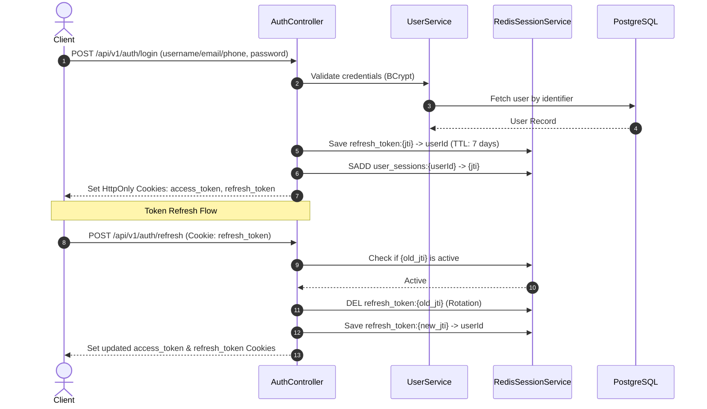
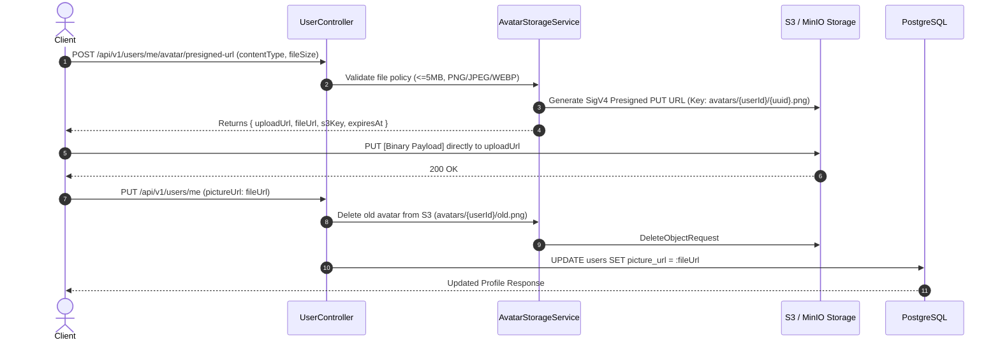
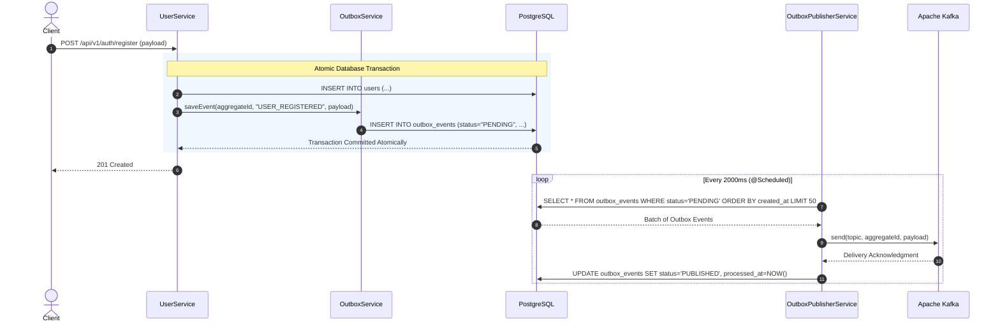

# 🚀 User Service (`user-service`)

[](https://openjdk.org/)
[](https://spring.io/projects/spring-boot)
[](https://www.postgresql.org/)
[](https://redis.io/)
[-black.svg)](https://kafka.apache.org/)
[](https://min.io/)
[](LICENSE)

An enterprise-grade, event-driven **User & Identity Microservice** built with **Spring Boot**, **PostgreSQL 17**, **Redis 7**, **MinIO/S3**, and **Apache Kafka**.

Designed with strict zero-trust security, dual-write consistency via the **Transactional Outbox Pattern**, fuzzy trigram full-text search, direct-to-cloud presigned avatar uploads, and dynamic policy enforcement.

---

## 📑 Table of Contents
- [Architecture Overview](#-architecture-overview)
- [Key Features](#-key-features)
- [Tech Stack](#-tech-stack)
- [System Workflows](#-system-workflows)
  - [1. Authentication & Redis Session Lifecycle](#1-authentication--redis-session-lifecycle)
  - [2. Direct S3/MinIO Avatar Upload Flow](#2-direct-s3minio-avatar-upload-flow)
  - [3. Transactional Outbox Domain Event Publishing](#3-transactional-outbox-domain-event-publishing)
- [Database Schema & Search Indexing](#-database-schema--search-indexing)
- [Configuration & Policy Engine](#-configuration--policy-engine)
- [API Reference](#-api-reference)
- [Local Infrastructure Setup (Docker Compose)](#-local-infrastructure-setup-docker-compose)
- [Building & Running Locally](#-building--running-locally)
- [Automated Testing Suite](#-automated-testing-suite)

---

## 🏛 Architecture Overview

```
                                  ┌─────────────────────────────┐
                                  │      API Gateway / Client   │
                                  └──────────────┬──────────────┘
                                                 │
                                                 ▼
             ┌───────────────────────────────────────────────────────────────────────┐
             │                          USER SERVICE CORE                            │
             │                                                                       │
             │   ┌───────────────────────┐         ┌───────────────────────────────┐ │
             │   │ JwtAuthentication     │         │ PolicyValidatorService        │ │
             │   │ Filter & UserContext  │         │ (user-policy.yml)             │ │
             │   └───────────┬───────────┘         └───────────────────────────────┘ │
             │               │                                                       │
             │   ┌───────────▼───────────┐         ┌───────────────────────────────┐ │
             │   │ REST Controllers      │         │ OutboxPublisherService        │ │
             │   │ (Auth, User, Follow)  │         │ (Scheduled Batch Poller)      │ │
             │   └───────────┬───────────┘         └──────────────┬────────────────┘ │
             └───────────────┼────────────────────────────────────┼──────────────────┘
                             │                                    │
           ┌─────────────────┼─────────────────┐                  │
           ▼                 ▼                 ▼                  ▼
    ┌─────────────┐   ┌─────────────┐   ┌─────────────┐    ┌─────────────┐
    │ PostgreSQL  │   │   Redis 7   │   │ MinIO / S3  │    │ Kafka Broker│
    │  Database   │   │  Sessions   │   │ Storage     │    │  (KRaft)    │
    │             │   │  & Token    │   │ Presigned   │    │             │
    │ • users     │   │  Revocation │   │ Avatar URLs │    │ • registered│
    │ • outbox    │   │             │   │             │    │ • deactivate│
    │ • follows   │   │             │   │             │    │             │
    └─────────────┘   └─────────────┘   └─────────────┘    └─────────────┘
```

---

## ✨ Key Features

### 🛡️ Enterprise Security & Authentication
- **Dual Token Architecture**:
  - **Access Token**: Short-lived (15 minutes), stateless HMAC-SHA256 JWT.
  - **Refresh Token**: Long-lived (7 days) with unique UUID JWT ID (`jti`) persisted in Redis.
- **Cookie Security**: Tokens delivered via `HttpOnly`, `SameSite=Strict`, `Secure` cookies with automatic fallback to `Authorization: Bearer <token>` headers for mobile clients.
- **Token Rotation & Instant Revocation**: Every refresh request rotates the token and invalidates the previous `jti`. User logout or account deactivation instantly purges session keys across all user devices.
- **Anti-Spoofing Context**: `JwtAuthenticationFilter` validates caller identity and enforces trusted boundary verification before population of the thread-local `UserContext`.
- **Google OAuth Integration**: Native Google ID Token verification (`com.google.api-client`), auto-provisioning new accounts or linking existing email identities.

### 🔍 PostgreSQL Trigram Fuzzy Search (`pg_trgm`)
- Native inverted **GIN trigram indexes** (`idx_users_username_trgm`, `idx_users_bio_trgm`) provisioned on startup via `DatabaseInitializer`.
- Typo-tolerant substring and similarity search scoring (`similarity(username, :q) > 0.2`) with exact prefix boosting.

### 🖼️ S3 / MinIO Profile Picture Presigned URLs
- **Direct-to-Cloud Uploads**: Backed by AWS SDK v2 (`S3Presigner`), clients upload large binaries directly to MinIO/S3 via SigV4 presigned PUT URLs, offloading network I/O from the app.
- **Policy Enforcement**: Pre-validates file sizes (max 5 MB) and MIME types (`image/jpeg`, `image/png`, `image/webp`).
- **Orphan Cleanup**: Updating a profile photo automatically triggers an asynchronous background deletion of the previous avatar object in S3/MinIO.

### 📬 Transactional Outbox Pattern (Apache Kafka)
- Prevents dual-write bugs and phantom events.
- Domain events (`user.registered.v1`, `user.deactivated.v1`) are written atomically to the `outbox_events` table inside the exact same database transaction as business logic.
- Background scheduled poller (`OutboxPublisherService`) batches pending events, publishes them to Kafka with retry counters, and marks records `PUBLISHED` upon delivery confirmation.

### 👥 Social Follow System
- Request/Accept/Reject workflow for **private accounts**.
- Instant follow for **public accounts**.
- Unfollow, follower count, and paginated follower/following listings.

---

## 🛠 Tech Stack

| Component | Technology | Version |
| :--- | :--- | :--- |
| **Language** | Java (OpenJDK) | 21 |
| **Framework** | Spring Boot | 4.1.1 |
| **Database** | PostgreSQL | 17 (Alpine) |
| **Caching / Sessions** | Redis | 7 (Alpine) |
| **Event Streaming** | Apache Kafka (KRaft mode) | 3.8.0 |
| **Object Storage** | MinIO / AWS S3 (AWS SDK v2) | 2.29.50 |
| **Security & JWT** | JJWT (io.jsonwebtoken) | 0.12.6 |
| **Password Hashing** | Spring Security Crypto (BCrypt) | Latest |
| **OAuth** | Google API Client | 2.7.0 |
| **Build Tool** | Apache Maven | 3.9+ |

---

## 🔄 System Workflows

### 1. Authentication & Redis Session Lifecycle



---

### 2. Direct S3/MinIO Avatar Upload Flow



---

### 3. Transactional Outbox Domain Event Publishing



---

## 💾 Database Schema & Search Indexing

### PostgreSQL Tables

#### 1. `users` Table
```sql
CREATE TABLE users (
    id UUID PRIMARY KEY,
    username VARCHAR(50) NOT NULL UNIQUE,
    email VARCHAR(100) UNIQUE,
    phone VARCHAR(20) UNIQUE,
    password_hash VARCHAR(255),
    bio VARCHAR(160),
    picture_url VARCHAR(500),
    public_profiles JSONB,
    is_active BOOLEAN NOT NULL DEFAULT TRUE,
    is_private BOOLEAN NOT NULL DEFAULT FALSE,
    is_email_verified BOOLEAN NOT NULL DEFAULT FALSE,
    is_phone_verified BOOLEAN NOT NULL DEFAULT FALSE,
    is_email_private BOOLEAN NOT NULL DEFAULT FALSE,
    is_phone_private BOOLEAN NOT NULL DEFAULT FALSE,
    is_picture_private BOOLEAN NOT NULL DEFAULT FALSE,
    disabled_at TIMESTAMP,
    created_at TIMESTAMP NOT NULL,
    updated_at TIMESTAMP NOT NULL
);

-- Trigram GIN indexes for typo-tolerant fuzzy matching
CREATE EXTENSION IF NOT EXISTS pg_trgm;
CREATE INDEX idx_users_username_trgm ON users USING gin (username gin_trgm_ops);
CREATE INDEX idx_users_bio_trgm ON users USING gin (bio gin_trgm_ops);
```

#### 2. `user_follows` Table
```sql
CREATE TABLE user_follows (
    follower_id UUID NOT NULL,
    following_id UUID NOT NULL,
    status VARCHAR(20) NOT NULL, -- ACCEPTED, PENDING, REJECTED
    created_at TIMESTAMP NOT NULL,
    PRIMARY KEY (follower_id, following_id),
    CONSTRAINT fk_follower FOREIGN KEY (follower_id) REFERENCES users(id) ON DELETE CASCADE,
    CONSTRAINT fk_following FOREIGN KEY (following_id) REFERENCES users(id) ON DELETE CASCADE
);
CREATE INDEX idx_user_follows_following_status ON user_follows(following_id, status);
```

#### 3. `outbox_events` Table
```sql
CREATE TABLE outbox_events (
    id UUID PRIMARY KEY,
    aggregate_type VARCHAR(50) NOT NULL,
    aggregate_id VARCHAR(100) NOT NULL,
    event_type VARCHAR(100) NOT NULL,
    topic VARCHAR(100) NOT NULL,
    payload TEXT NOT NULL,
    status VARCHAR(20) NOT NULL DEFAULT 'PENDING',
    retry_count INT NOT NULL DEFAULT 0,
    error_message TEXT,
    created_at TIMESTAMP NOT NULL,
    processed_at TIMESTAMP
);
CREATE INDEX idx_outbox_events_status_created ON outbox_events(status, created_at);
```

---

## ⚙️ Configuration & Policy Engine

Policy rules are completely decoupled into `src/main/resources/user-policy.yml`:

```yaml
user-policy:
  auth:
    mode: EITHER           # EITHER (email or phone), BOTH, ONLY_EMAIL, ONLY_PHONE
    allow-google: true     # Enable / Disable Google OAuth
  profile:
    username:
      min-length: 3
      max-length: 30
      regex: "^[a-zA-Z0-9_.]+$"
    bio:
      max-length: 160
    avatar:
      max-size-bytes: 5242880 # 5 MB
      allowed-content-types:
        - "image/jpeg"
        - "image/png"
        - "image/webp"
  deactivation:
    grace-period-days: 30
```

---

## 📡 API Reference

### 1. Authentication Endpoints (`/api/v1/auth`)

| Method | Endpoint | Description | Auth Required |
| :--- | :--- | :--- | :---: |
| `POST` | `/api/v1/auth/register` | Register new user account | No |
| `POST` | `/api/v1/auth/login` | Login with username/email/phone & password | No |
| `POST` | `/api/v1/auth/google` | Sign in or auto-provision with Google ID Token | No |
| `POST` | `/api/v1/auth/refresh` | Rotate session tokens using refresh cookie | Yes (Cookie) |
| `POST` | `/api/v1/auth/logout` | Revoke session and clear cookies | Yes (Cookie) |

#### Register Request Body:
```json
{
  "username": "johndoe",
  "email": "john@example.com",
  "phone": "+1234567890",
  "password": "SecurePassword123!"
}
```

---

### 2. User & Profile Endpoints (`/api/v1/users`)

| Method | Endpoint | Description | Auth Required |
| :--- | :--- | :--- | :---: |
| `GET` | `/api/v1/users/{id}` | Get user profile by UUID | Optional |
| `GET` | `/api/v1/users/by-username/{username}` | Get user profile by username | Optional |
| `PUT` | `/api/v1/users/me` | Update authenticated user's profile | **Yes** |
| `POST` | `/api/v1/users/me/avatar/presigned-url` | Generate S3 presigned upload URL | **Yes** |
| `DELETE` | `/api/v1/users/me` | Deactivate account and revoke all sessions | **Yes** |
| `GET` | `/api/v1/users/search?q={query}` | Typo-tolerant trigram search | No |

#### Requesting Avatar Presigned Upload URL:
```json
// POST /api/v1/users/me/avatar/presigned-url
{
  "contentType": "image/png",
  "fileSizeBytes": 1048576
}

// Response
{
  "uploadUrl": "http://localhost:9000/user-avatars/avatars/user-id/uuid.png?X-Amz-...",
  "fileUrl": "http://localhost:9000/user-avatars/avatars/user-id/uuid.png",
  "s3Key": "avatars/user-id/uuid.png",
  "expiresAt": "2026-10-08T10:15:00Z"
}
```

---

### 3. Follow & Social Graph Endpoints (`/api/v1/users`)

| Method | Endpoint | Description | Auth Required |
| :--- | :--- | :--- | :---: |
| `POST` | `/api/v1/users/follows` | Follow a user (body: `{ "targetUserId": "..." }`) | **Yes** |
| `DELETE` | `/api/v1/users/follows/{targetUserId}` | Unfollow a user | **Yes** |
| `POST` | `/api/v1/users/follows/respond` | Accept/Reject follow request (body: `{ "followerId": "...", "accept": true }`) | **Yes** |
| `GET` | `/api/v1/users/{id}/followers` | List paginated followers of a user | No |
| `GET` | `/api/v1/users/{id}/following` | List paginated users followed by user | No |

---

## 🐳 Local Infrastructure Setup (Docker Compose)

The repository provides a complete multi-container stack orchestrated via [`docker-compose.yml`](docker-compose.yml):

```bash
docker compose up -d
```

### Services Started:
- **PostgreSQL 17** (`localhost:5432`): Database `userServiceDB`, User `postgres`, Password `password`.
- **Redis 7** (`localhost:6379`): Session storage and token revocation engine.
- **MinIO S3** (`localhost:9000`, Web UI Console: `http://localhost:9001`): User `minioadmin`, Password `minioadmin`.
- **MinIO Bucket Auto-Init (`create-buckets`)**: Automatically provisions `user-avatars` bucket with public read access.
- **Apache Kafka 3.8.0** (`localhost:9092`): Running in modern KRaft mode (ZooKeeper-less).

To stop all services:
```bash
docker compose down -v
```

---

## 💻 Building & Running Locally

### Prerequisites
- JDK 21+
- Docker & Docker Compose
- Maven 3.9+ (or use included `./mvnw`)

### 1. Start Infrastructure
```bash
docker compose up -d
```

### 2. Run Application
```bash
./mvnw spring-boot:run
```
The service will start on `http://localhost:8080`.

---

## 🧪 Automated Testing Suite

The project includes unit, repository, and end-to-end integration tests using MockMvc, `@SpringBootTest`, and in-memory mock interceptors:

```bash
./mvnw clean test
```

### Coverage Highlights:
- **`AuthControllerIntegrationTest`**: Complete cookie authentication lifecycle, token rotation, and Redis instant revocation.
- **`UserSecurityIntegrationTest`**: Strict header anti-spoofing tests, bearer token parsing, and user context isolation.
- **`UserSearchIntegrationTest`**: Fuzzy trigram similarity search queries and username collision checks.
- **`AvatarPresignedUrlIntegrationTest`**: SigV4 upload URL signing and orphan avatar deletion lifecycle.
- **`OutboxIntegrationTest`**: Atomic transaction event saving, Kafka publishing, and retry status transitions.

---

## 📄 License
This project is licensed under the Apache 2.0 License.
